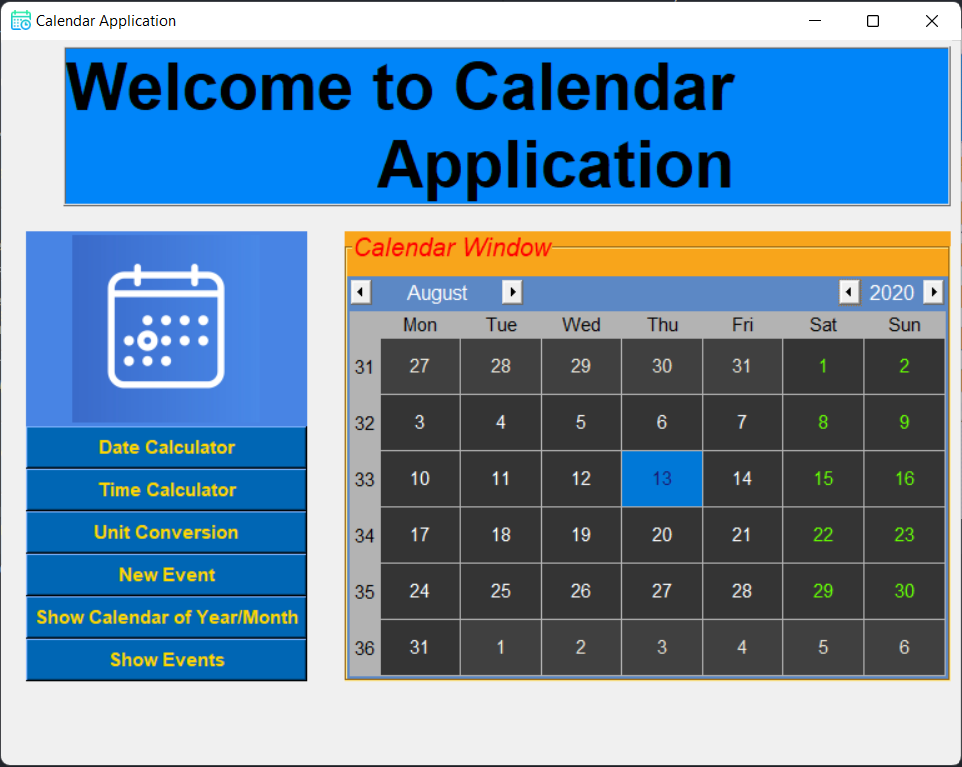
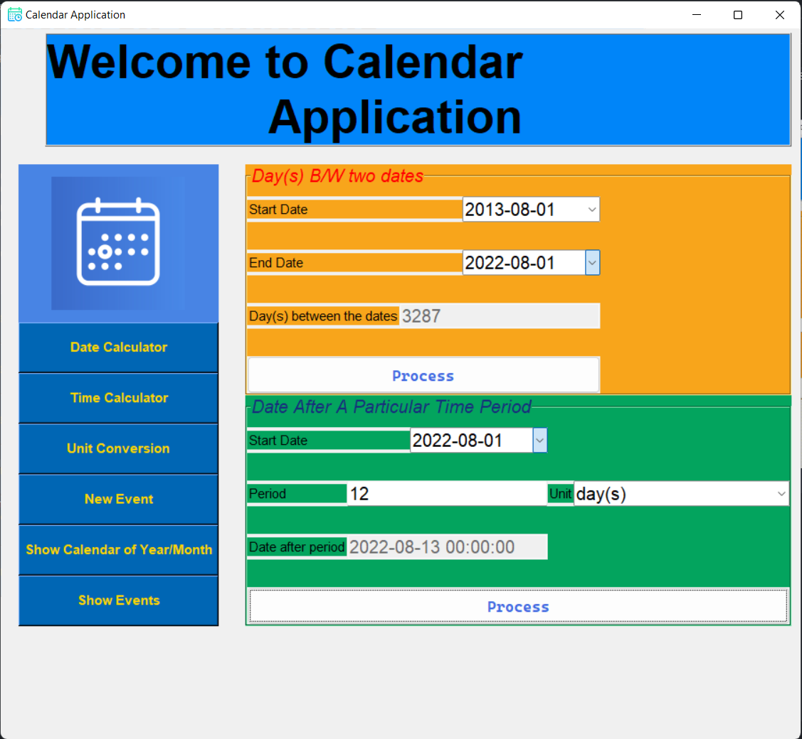
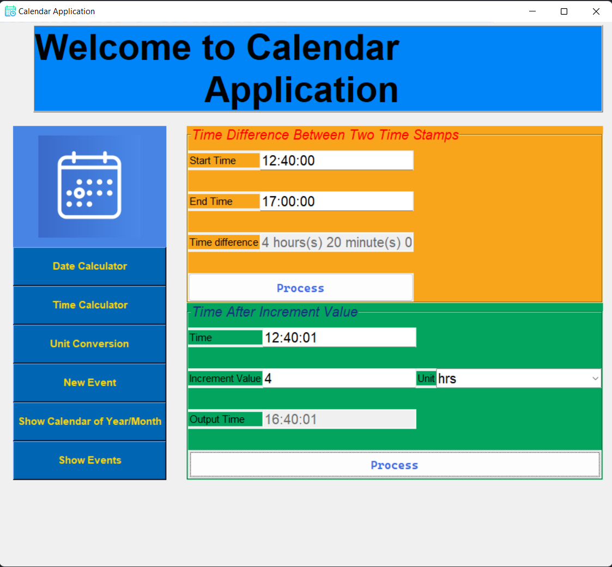
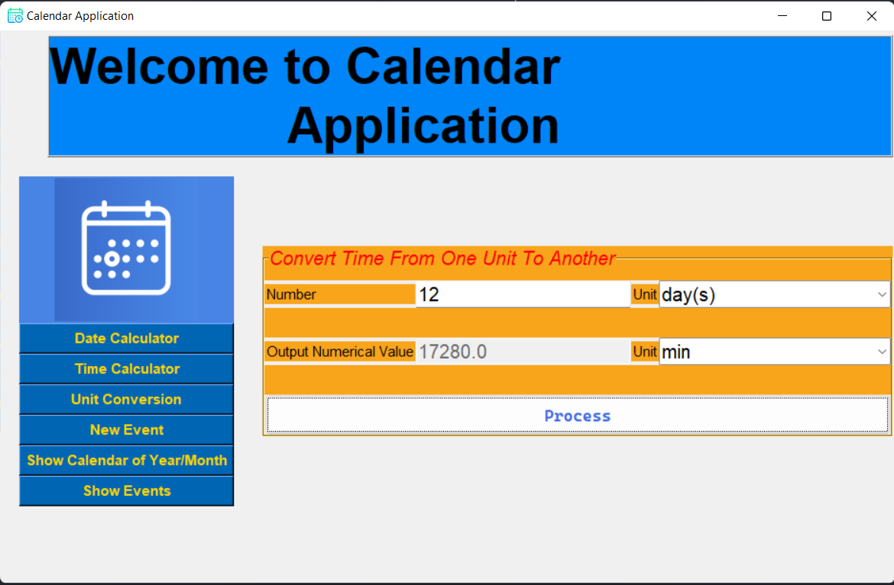
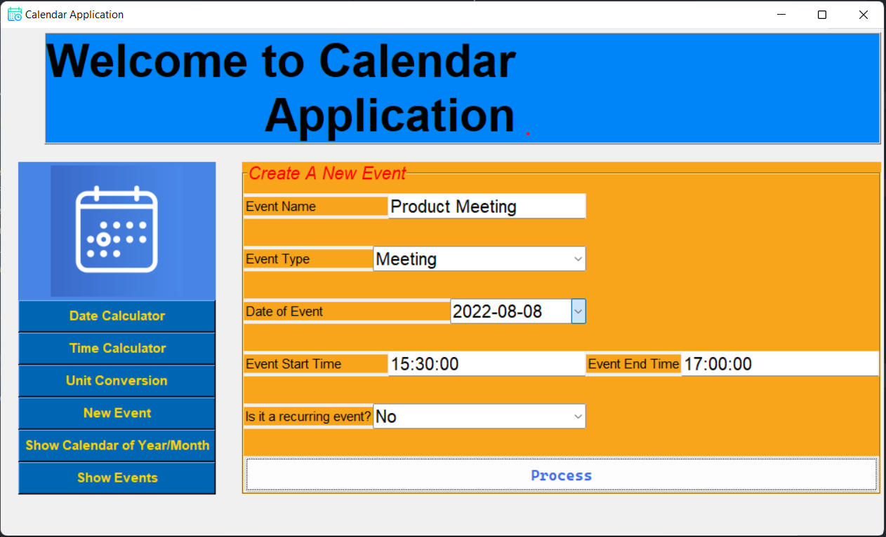

# Calendar Using Tkinter

CalendarInTkinter is an implementation of calendar using tkinter package of python. Both Tk and tkinter are available on
most Unix platforms, including macOS, as well as on Windows systems.


## Features

- Multiple User login as well as authentication
- Storing user data in user's file structure, in csv format
- **C**reation, **R**ead, **U**pdate, **D**elte, on calendar-events of users
- Time related calculations
    - Date after a particular time period from a given date
    - Time difference between given two dates
    - Time after a particular time period
- Time Unit conversions from
    - sec to min
    - year to week
    - month to days etc.

## Installation

```bash
git clone https://github.com/ujjwalgarg100204/CalendarInTkinter.git
```

## Dependencies

- Python 3.10+
    - Babel==2.10.3
    - future==0.18.2
    - pytz==2022.1
    - tkcalendar==1.6.1

## Run in your local environment

```bash
# for linux & mac based systems 

# create a virtual environment
python3 -m venv env

# activate virtual environment
source env/bin/activate

# install dependencies from requirements.txt
python3 -m pip install -r requirements.txt

# run the project
python3 main.py
```
> Some Linux users might not have tkinter preinstalled, so they need to run ```sudo apt-get install python3-tk```

```cmd
:: For Windows

:: create a virtual enviornment
py -m venv env

:: activate virtual enviornment
.\env\Scripts\activate

:: install dependencies from requirements.txt
py -m pip install -r requirements.txt

:: run the project
py main.py
```

## Screenshots







## Contributing

Pull requests are welcome. For major changes, please open an issue first to discuss what you would like to change.

## License

[MIT](LICENSE.txt)
